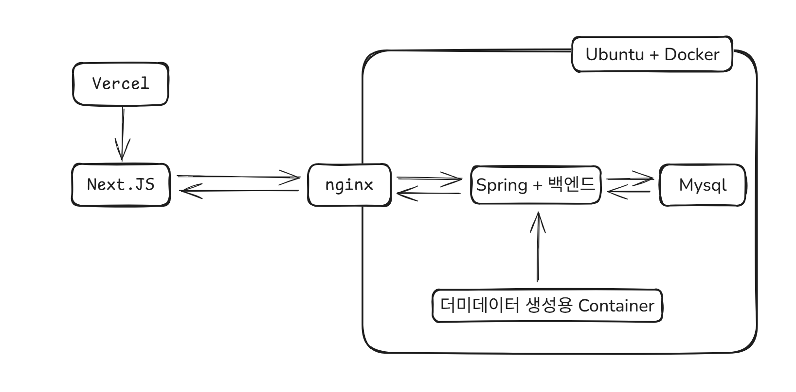

# control-api

- 서울시 버스 관제 시스템 MVP 백엔드 API
- 버스 목록, 버스 상세, 최근 이벤트 조회 API 제공
- Simulator 또는 차량 단말 텔레메트리 수신 API 제공
- 초기 기준 데이터 Seed 자동 주입

## 프로젝트 도식도



## 실행 환경

- Java 21 + Spring Boot 4.1.0
- 로컬(테스트) 기본 프로필 `local`
- 로컬(테스트) 기본 DB H2 인메모리
- 배포 프로필 `prod`
- 배포 DB MySQL + Docker
- 기본 실행 포트 `9090`
  - application.yml + docker compose 지정

## 실행 방법

- Docker Compose 외부 네트워크 필요

### Docker를 통한 실행 방법

```bash
MYSQL_HOST=mysql \
MYSQL_PORT=3306 \
MYSQL_DATABASE=test_db \
MYSQL_USERNAME=test_user \
MYSQL_PASSWORD=test_password \
docker compose up -d --build
```

- MySQL 환경변수

```text
MYSQL_HOST
MYSQL_PORT
MYSQL_DATABASE
MYSQL_USERNAME
MYSQL_PASSWORD
```

## 기술 선택 이유

### Next.js

- 타 선택지 대비 SSR 로 유연한 확장 가능 구조
- 렌더링 전략 선택 폭
  - CSR뿐 아니라 SSR, SSG, ISR, Streaming SSR, Server Components 조합 가능
  - 페이지·컴포넌트·데이터 단위로 렌더링/캐시 전략 설계 가능

### CommandLineRunner 

- data.sql 이 단순 초기화 관점에선 더 강점이 있지만
  - 애플리케이션 컨텍스트 초기화 과정과 DB 초기화 타이밍에 묶여 있어, JPA/Hibernate의 DDL 생성 순서와 충돌 가능성 존재
- 반면 CommandLineRunner 는 대체로 Spring Context와 JPA EntityManagerFactory 초기화 이후 실행
  - repository나 테이블이 준비된 뒤 데이터를 넣는 흐름을 만드는 데 강점

  
### bus-simulator 별도 컨테이너 구성

- Mock 운행 데이터 생성 책임을 `control-api`에서 분리하기 위해 `bus-simulator`를 별도 컨테이너로 구성
- `control-api`는 조회 API와 텔레메트리 저장 책임에 집중하고, `bus-simulator`는 위치·속도·이벤트 Mock 데이터 생성만 담당
- API 서버를 수평 확장해도 Scheduler가 중복 실행되지 않아 운영 구조가 단순해짐
- 이후 실제 차량 단말 또는 GPS 수집 서버로 교체하기 쉬운 확장 구조

### Vercel

- Next.js 배포에 최적화된 플랫폼이라 별도 서버 설정 없이 빠르게 배포 가능
- 무료 플랜에서도 MVP 수준의 관제 화면을 배포하고 확인 가능

### H2 + MySQL 프로파일 분리

- 로컬과 테스트 환경은 H2 인메모리 DB를 사용해 별도 DB 설치 없이 빠르게 실행
- 배포 환경은 MySQL을 사용해 실제 운영 환경에 가까운 구조로 구성
- `local`, `prod` 프로파일을 분리해 실행 환경별 DB 설정을 명확히 관리

### MongoDB 고려 및 미도입

- 위치 이력과 이벤트 이력은 계속 누적되는 데이터라 MongoDB 분리 가능성을 검토
- 다만 MVP 단계에서는 인프라 복잡도를 줄이기 위해 MySQL에 함께 저장

### Docker 멀티 스테이지 빌드

- Gradle 빌드 단계와 애플리케이션 실행 단계를 분리해 Docker 이미지를 생성
- 실행 이미지에는 빌드 도구와 중간 산출물을 포함하지 않아 이미지 크기와 불필요한 의존성을 줄일 수 있음
- Docker Compose와 함께 사용해 MySQL 환경변수, 실행 프로필, 포트 설정을 배포 환경에서 일관되게 관리

### rsync 기반 배포

- mvp 단계에서 CI/CD 배포 구조는 과하다고 생각
- 개인 서버 배포를 위해 `rsync`로 프로젝트 파일을 원격 서버에 동기화
- 변경된 파일만 전송하므로 배포 시간이 짧고, SSH key 기반 터널링으로 안전하게 전송 가능
- 서버에서는 동기화된 파일을 기준으로 Docker Compose를 실행해 컨테이너 환경으로 배포